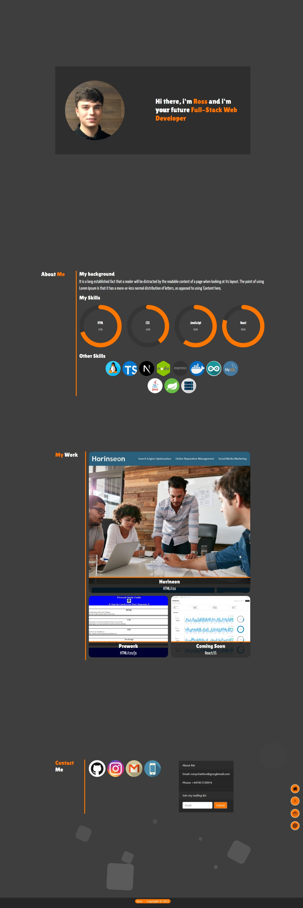

# Ross Charlton - Bootstrap - Web development portfolio 🚀

## Description
This repository showcases my web development portfolio using Bootstrap, as a testament to my skills in the dynamic field of web development. Crafted with a mission to highlight my expertise, it serves as a vital asset in today's competitive market.

The main aim of this GitHub project is to use Bootstrap to improve on [previous portfolio](https://github.com/RossNE99/HTML-CSS-portfolio). The motivation behind this project was to recreate my portfolio and retain the functionality and with thanks to the use of Bootstrap the code in this project should be a lot cleaner and give an overall, more professional look to the site. 

The problem with vanilla CSS is that it requires everything to be written from scratch, you have to create all your utility classes from scratch, doing this creates a lot of boilerplate code which also wastes a lot of time. Bootstrap is the answer to this as bootstrap provides a good range of useful utility classes which can be used throughout your code, as many times as you want! Not only that but it also has pre made components to use such as; Navbar, Cards, Jumbotron and Forms etc. By utilising bootstrap I have halved my CSS file in length compared to my original portfolio.

## Table of Contents

- [Dev Requirements](#Dev-Requirements)
- [Dev Environment Setup](#Dev-Environment-Setup)
- [Enduser usage instructions](#End-user-usage-instructions)
- [Features](#Features)
- [How to contribute](#How-to-contribute)
- [technologies ](#technologies)
- [Screenshot](#Screenshot)
- [Credits](#credits)
- [License](#license)

## Dev Requirements
Git/GitBash, VS Code, and the source code, of course! 🛠️

## Dev Environment Setup
To get the development environment running:
1. Clone this repo
2. Open the repo folder in VS Code
3. Right-click on `index.html` and open it using the default browser..

- `index.html`: Contains all HTML code for the webpage
- `css/`: Contains all CSS code for the webpage
- `images/`: Contains all images used in the webpage

## Enduser usage instructions
There is no special requirements for end users. Simply visit [here](https://rossne99.github.io/Bootstrap-portfolio/) to view the webpage.

## Features
- **Fully Responsive:** This webpage uses media querys to ensure that the content fits on any screen size.
- **Robust Layout:** Grid and flexbox has been used inorder to make sure all elements stay formatted correctly.
- **Fixed Navber:** The navbar is now fixed to the top of the page this is useful for accessibility additionally all the links in the nav bar now work.
- **Links to Previous Projets:** All featured applcations link to the deployed page.
- **Bootstrap:** Bootstrap has been used to reduce boilerplate code, and to make the webpage look more profesional

## How to contribute
1. Fork this repository
2. Clone the repository
3. Create a branch for your bug fix or feature
4. Make necessary changes and commit those changes
5. Push changes to GitHub
6. Create a pull request to this repo to submit your changes for review

## Technologies
- **HTML**
- **CSS**
- **Bootstrap** 

## Screenshot

The following image shows the web application's appearance and functionality:

> **Note**: This layout is designed to be fully responive.

## Credits 
- **Ross** - Source Code

---

## Licence

MIT License

Copyright (c) 2023 RossNE99

Permission is hereby granted, free of charge, to any person obtaining a copy
of this software and associated documentation files (the "Software"), to deal
in the Software without restriction, including without limitation the rights
to use, copy, modify, merge, publish, distribute, sublicense, and/or sell
copies of the Software, and to permit persons to whom the Software is
furnished to do so, subject to the following conditions:

The above copyright notice and this permission notice shall be included in all
copies or substantial portions of the Software.

THE SOFTWARE IS PROVIDED "AS IS", WITHOUT WARRANTY OF ANY KIND, EXPRESS OR
IMPLIED, INCLUDING BUT NOT LIMITED TO THE WARRANTIES OF MERCHANTABILITY,
FITNESS FOR A PARTICULAR PURPOSE AND NONINFRINGEMENT. IN NO EVENT SHALL THE
AUTHORS OR COPYRIGHT HOLDERS BE LIABLE FOR ANY CLAIM, DAMAGES OR OTHER
LIABILITY, WHETHER IN AN ACTION OF CONTRACT, TORT OR OTHERWISE, ARISING FROM,
OUT OF OR IN CONNECTION WITH THE SOFTWARE OR THE USE OR OTHER DEALINGS IN THE
SOFTWARE.
